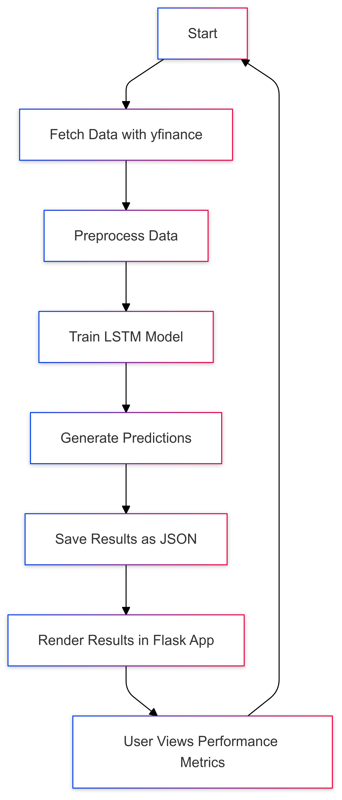

# LSTM-FinTrends

LSTM-FinTrends is an end-to-end project that forecasts the directional movement of stock indices based on derived metrics using an LSTM (Long Short-Term Memory) deep learning model. The goal is not to create a live application but to demonstrate a complete workflow from data preprocessing to model prediction, data storage, and visualization. The project includes key technologies like LSTM for forecasting, data collection using yfinance, a Flask web app for rendering results, and process automation using GitHub Actions.

## Project Overview

1. **Data Collection**: Index data is collected for different stock tickers using the `yfinance` library. The data includes derived metrics, like close price direction, percentage changes, and rolling averages.
2. **Model**: An LSTM model is used for its effectiveness in capturing temporal dependencies, making it suitable for time series data. The model forecasts the direction of the stock's close price based on previous values.
3. **Storage and Visualization**: The forecasted results, including metrics like confusion matrix and accuracy, are stored in JSON files. These results are rendered through a Flask web interface.
4. **Automation**: GitHub Actions are used to automate the process as defined in `actions.yml`.

## Main Technologies

- **LSTM**: Chosen for its ability to process sequences, making it effective for time series analysis.
- **yfinance**: Used to fetch historical stock data for various tickers.
- **Flask**: Provides a simple web interface to display model predictions.
- **GitHub Actions**: Automates the end-to-end process.

## Project Structure

```plaintext
.
├── app.py                 # Flask app for visualization
├── lstm.py                # LSTM model training and prediction
├── preprocessing.py       # Data preprocessing
├── requirements.txt       # Required Python packages
├── tickers.json           # JSON file with ticker symbols and countries
├── logs                   # Folder containing logs for the whole process
│   └── models_forecast.log
├── templates/
│   └── home.html          # Template for Flask app home page
│   └── performance.html   # Template for Flask app results page
└── results/               # JSON files with model predictions for each ticker
```
## Implementation Steps

1. **Data Preprocessing** (`preprocessing.py`):
   - Historical data is fetched using `yfinance`.
   - Derived metrics, such as percentage changes, rolling averages, and RSI, are calculated.
   - The data is split into training and testing sets and scaled for model input.

2. **Model Training and Prediction** (`lstm.py`):
   - The LSTM model is structured with multiple layers, including dropout for regularization.
   - The model is trained on each ticker's data and saved predictions are stored in JSON format for visualization.

3. **Visualization** (`app.py`):
   - A Flask web app displays the results. Users can select a ticker to view the actual vs. predicted close price trends and confusion matrix.
   
4. **Automation** (`actions.yml`):
   - GitHub Actions automate the process to run data fetching, model training, and result generation on defined schedules.

## Running Locally

To run this project locally:

1. **Clone the Repository**:
   ```bash
   git clone https://github.com/MunjPatel/LSTM-FinTrends.git
   cd LSTM-FinTrends
   ```
2. **Install Requirements**:
   ```bash
   pip install -r requirements.txt
   ```
3. **Run the Flask App**:
   ```bash
   flask run
   ```
The app will be available at `http://127.0.0.1:5000`, where you can view the model’s predictions and performance metrics.

## Flowchart



## License

This project is licensed under the MIT License - see the [LICENSE](./LICENSE) file for details.
